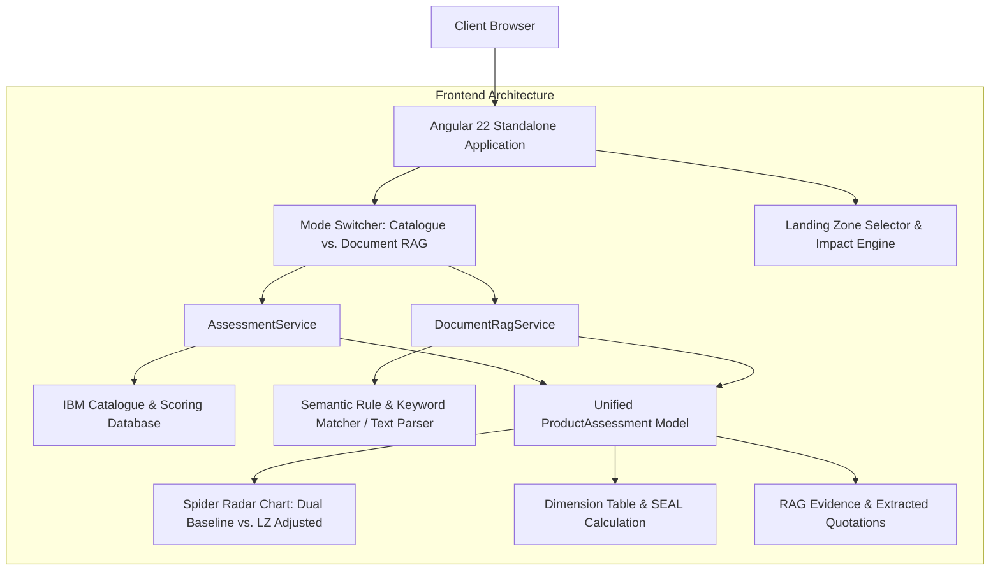

# IBM IRN / CSF Sovereignty Analyzer 🛡️🇪🇺

An enterprise evaluation & decision-support platform designed to assess IT products, platforms, and architectures against the **8 dimensions** of the French **Indice de Résilience Numérique (IRN - Bercy)** and the European **Cloud Sovereignty Framework (CSF)**.

The tool provides instant positioning across the Sovereignty Effective Assurance Levels (**SEAL-0 to SEAL-4**), dual-layer radar Spider Chart visualization, landing zone impact analysis (On-Premises, IBM Cloud, Hyperscalers, SecNumCloud & European Sovereign Clouds), and an on-demand **Document RAG (Retrieval-Augmented Generation) Analyzer**.

---

## 📑 Table of Contents
1. [Overview & Functional Purpose](#overview--functional-purpose)
2. [The 8 Sovereignty Dimensions & SEAL Levels](#the-8-sovereignty-dimensions--seal-levels)
3. [Key Features](#key-features)
   - [Mode 1: Curated IBM Technology 2026 Catalogue](#mode-1-curated-ibm-technology-2026-catalogue)
   - [Mode 2: On-Demand Document RAG Analyzer](#mode-2-on-demand-document-rag-analyzer)
   - [Landing Zone Impact Engine](#landing-zone-impact-engine)
4. [Application Architecture & Tech Stack](#application-architecture--tech-stack)
5. [Input Files & Data Models](#input-files--data-models)
6. [Installation & Getting Started](#installation--getting-started)
   - [Option A: Running in Development Mode](#option-a-running-in-development-mode)
   - [Option B: Running the Pre-Packaged Standalone Distribution](#option-b-running-the-pre-packaged-standalone-distribution)
7. [User Guide & Workflow](#user-guide--workflow)
8. [Project Structure](#project-structure)

---

## 🎯 Overview & Functional Purpose

European organizations, public institutions, financial entities (under DORA/NIS2), and regulated industries face growing compliance requirements regarding data sovereignty, operational autonomy, legal immunity against extraterritorial regulations (e.g. US CLOUD Act, FISA 702), and software supply chain resilience.

The **IBM IRN / CSF Sovereignty Analyzer** helps architects, compliance officers, and procurement teams:
- Evaluate products against standardized French (IRN) and EU (CSF) sovereignty criteria.
- Model the real-world impact of different deployment **Landing Zones** (e.g., On-Premises, SecNumCloud offerings like S3NS, Bleu, OVHcloud, Cloud Temple, NumSpot, or Hyperscalers).
- Upload and inspect architecture documents, whitepapers, contracts, and datasheets in **RAG mode** to automatically infer sovereignty ratings and extract supporting textual evidence.

---

## 📊 The 8 Sovereignty Dimensions & SEAL Levels

### 8 Evaluation Dimensions (with official CSF weights):
| Code (IRN) | Code (CSF) | Dimension Label | Weight | Key Evaluation Criteria |
|:---|:---|:---|:---:|:---|
| **RES-1** | **SOV-1** | Strategic Sovereignty | **20%** | EU governance, corporate ownership, control stability, EU funding & industrial alignment. |
| **RES-2** | **SOV-2** | Legal & Jurisdictional Sovereignty | **10%** | Governing jurisdiction, exposure to foreign/extraterritorial laws (CLOUD Act), immunity mechanisms. |
| **RES-3** | **SOV-3** | Data & AI Sovereignty | **10%** | Customer-controlled encryption (KYOK/BYOK), EU data residency, verifiable erasure, open AI models. |
| **RES-4** | **SOV-4** | Operational Sovereignty | **15%** | Workload portability, operational autonomy without non-EU dependencies, EU talent pool & support. |
| **RES-5** | **SOV-5** | Supply Chain Sovereignty | **10%** | Hardware/firmware provenance, software SBOM transparency, multi-sourcing, vendor reliance. |
| **RES-6** | **SOV-6** | Technology Sovereignty | **15%** | Open standards compliance (W3C/OIDC/K8s), open source code availability, architecture transparency. |
| **RES-7** | **SOV-7** | Security & Compliance Sovereignty | **15%** | Certifications (SecNumCloud, ISO 27001, CC EAL, FIPS), EU-based SOC, incident handling, audit rights. |
| **RES-8** | **SOV-8** | Environmental Sustainability | **5%** | Infrastructure energy efficiency (PUE targets), circular economy, carbon footprint transparency. |

### Sovereignty Effective Assurance Levels (SEAL):
- **SEAL-0 (No Sovereignty)**: Governed entirely in non-EU jurisdictions with exclusive foreign control.
- **SEAL-1 (Jurisdictional Sovereignty)**: EU law formally applies with limited practical enforceability.
- **SEAL-2 (Data Sovereignty)**: EU law applicable and enforceable, with material non-EU dependencies remaining.
- **SEAL-3 (Digital Resilience)**: EU law enforceable; EU actors exercise meaningful influence with marginal foreign control.
- **SEAL-4 (Full Digital Sovereignty)**: Complete EU control, subject strictly to EU law, with no critical non-EU dependencies.

*Note: Following the official CSF calculation methodology, the Global SEAL level is governed by the minimum score across all 8 dimensions (weakest link principle), while the weighted percentage score reflects overall posture.*

---

## 🚀 Key Features

### Mode 1: Curated IBM Technology 2026 Catalogue
- Comprehensive catalogue spanning **AI & Data Platforms** (*watsonx.ai, watsonx.data, watsonx.governance, watsonx Orchestrate, IBM Bob, Cloud Pak for Data*), **Hybrid Cloud & Infrastructure** (*Red Hat OpenShift, RHEL, IBM Power, IBM z16, FlashSystem*), **Security** (*QRadar SIEM/SOAR, Guardium, Hyper Protect Crypto Services*), **Automation & Integration** (*Cloud Pak for Integration, MQ, API Connect, DataStage, Sovereign Core*), and more.
- Each entry includes pre-assessed base scores and detailed analytical rationales.

### Mode 2: On-Demand Document RAG Analyzer
- Drag-and-drop or upload custom architecture briefs, contracts, service terms, or product sheets (`.pdf`, `.docx`, `.md`, `.txt`, `.json`, `.yaml`).
- Built-in semantic keyword matching and document retrieval engine extracts evidence across legal, cryptographic, operational, and architectural criteria.
- Suggests SEAL levels dynamically and extracts **literal citation quotes** into a dedicated **"Preuves & Extraits RAG Détectés"** tab.
- Includes preloaded sample scenarios (*watsonx.ai on Cloud Temple SecNumCloud*, *OVHcloud SecNumCloud*, and *Global SaaS Hyperscaler US*).

### Landing Zone Impact Engine
Allows positioning any product or document onto specific deployment infrastructures, automatically calculating positive or negative sovereignty delta modifiers:
- **On-Premises / Private Cloud** (Customer Data Center)
- **IBM Cloud** (EU Multizone Regions: Paris, Frankfurt, Madrid)
- **Hyperscalers (US)** (AWS, Azure, Google Cloud EU Regions)
- **S3NS** (Google Cloud powered by Thales – ANSSI SecNumCloud)
- **Bleu** (Microsoft Azure powered by Capgemini & Orange – ANSSI SecNumCloud)
- **OVHcloud** (Hosted Private Cloud & Public Cloud – ANSSI SecNumCloud)
- **Scaleway** (European Multi-AZ Public Cloud)
- **Cloud Temple** (ANSSI SecNumCloud IaaS & OpenShift PaaS)
- **NumSpot** (French Sovereign Cloud: Docaposte, Banque des Territoires, Naval Group, Dassault)
- **Local EU CSPs** (Regional EU Cloud Service Providers)

---

## 🏛️ Application Architecture & Tech Stack



- **Framework**: Angular 22 (Standalone Components, Signals & Reactive bindings)
- **Visualizations**: Chart.js Radar Controller
- **Styling**: SCSS (IBM Carbon-inspired palette, fully responsive)
- **Local Server**: Node.js static distribution powered by `@zeit/serve`

---

## 📂 Input Files & Data Models

| File Path | Description |
|:---|:---|
| [`Annex - Sovereignty assessment calculator.xlsx`](./Annex%20-%20Sovereignty%20assessment%20calculator.xlsx) | Reference European Cloud Sovereignty Framework spreadsheet calculator defining dimension weights, SEAL-0 to SEAL-4 thresholds, and scoring formulas. |
| [`irn-csf.model.ts`](./irn-csf-analyzer/src/app/models/irn-csf.model.ts) | Core TypeScript interfaces defining `IrnDimension`, `LandingZone`, `SealLevel`, `RagEvidence`, and `ProductAssessment`. |
| [`ibm-products.data.ts`](./irn-csf-analyzer/src/app/data/ibm-products.data.ts) | Curated catalog of IBM Technology 2026 products categorized across AI, Infrastructure, Security, Automation, and Analytics. |
| [`irn-scoring.data.ts`](./irn-csf-analyzer/src/app/data/irn-scoring.data.ts) | Baseline scoring definitions and dimension rationales for IBM products. |
| [`document-rag.service.ts`](./irn-csf-analyzer/src/app/services/document-rag.service.ts) | Parser and RAG rule inference engine matching document contents with sovereignty dimensions. |

---

## 💻 Installation & Getting Started

### Prerequisites
- Node.js (v18+ or v20+ recommended)
- npm (v9+)

### Option A: Running in Development Mode

```bash
# 1. Clone the repository
git clone https://github.com/F076186/ibm-irn-csf-analyzer.git
cd ibm-irn-csf-analyzer

# 2. Run the startup script (installs dependencies and starts Angular dev server)
./run.sh

# Or manually:
cd irn-csf-analyzer
npm install
npm start
```
The application will open automatically at `http://localhost:4200`.

---

### Option B: Running the Pre-Packaged Standalone Distribution

The repository includes a ready-to-run self-contained package under the `package/` folder:

#### On macOS / Linux:
```bash
cd package
./start-macos.sh
```
*(Optionally specify a custom port: `./start-macos.sh --port 9090`)*

#### On Windows:
```cmd
cd package
start-windows.bat
```
The application will open in your default browser at `http://localhost:8080`.

---

## 📖 User Guide & Workflow

1. **Select Assessment Mode**:
   - Click **📦 Catalogue IBM Technology 2026** to explore curated IBM software/hardware products.
   - Click **📄 Analyse Documentaire RAG à la demande** to analyze your own documentation.
2. **Configure Product or Upload Document**:
   - In *Catalogue Mode*: Select the category and product from the dropdowns.
   - In *RAG Mode*: Drag and drop a file or click one of the preloaded example buttons (*watsonx.ai + Cloud Temple*, *OVHcloud*, or *US Hyperscaler*).
3. **Select the Target Landing Zone**:
   - Choose the landing zone to simulate (e.g. *On-Premises*, *IBM Cloud*, *Cloud Temple SecNumCloud*, *Bleu*, *S3NS*, *OVHcloud*, etc.).
4. **Explore the Results**:
   - **Global Banner**: Review the overall SEAL grade and weighted score percentage.
   - **🕸 Spider Chart IRN**: Inspect the 8-axis radar chart displaying both the **Landing Zone Adjusted Score** and the **Baseline Score**.
   - **📊 Détail des Dimensions**: Review the tabular breakdown with base scores, adjusted scores, and rationale explanations.
   - **🔍 Preuves & Extraits RAG Détectés**: Review the confidence ratings, matched keywords, and extracted quotation snippets from the uploaded document.

---

## 🌳 Project Structure

```text
IRN_CSF_ANALYZER/
├── Annex - Sovereignty assessment calculator.xlsx  # Reference EU Sovereignty Calculator
├── Cloud Sovereignty Framework vs. IRN.docx        # Framework comparison whitepaper
├── README.md                                       # Project documentation
├── run.sh                                          # Quickstart dev script
├── ibm-irn-csf-analyzer.zip                        # Portable distribution archive
├── package/                                        # Pre-packaged production bundle
│   ├── app/browser/                                # Compiled Angular assets
│   ├── install-macos.sh                            # macOS/Linux installer
│   ├── start-macos.sh                              # macOS/Linux launcher
│   └── start-windows.bat                           # Windows launcher
└── irn-csf-analyzer/                               # Angular source code
    ├── src/
    │   ├── app/
    │   │   ├── components/
    │   │   │   ├── dimension-table/                # Detailed dimension breakdown table
    │   │   │   ├── seal-legend/                    # SEAL-0 to SEAL-4 color-coded legend
    │   │   │   └── spider-chart/                   # Radar Chart.js visualizer
    │   │   ├── data/
    │   │   │   ├── ibm-products.data.ts            # IBM Technology catalog
    │   │   │   └── irn-scoring.data.ts             # Baseline scoring rules
    │   │   ├── models/
    │   │   │   └── irn-csf.model.ts                # TypeScript interfaces & Landing Zones
    │   │   ├── services/
    │   │   │   ├── assessment.service.ts           # SEAL scoring & Landing Zone modifier engine
    │   │   │   └── document-rag.service.ts         # Document parser & RAG inference engine
    │   │   ├── app.html                            # Main application layout
    │   │   ├── app.scss                            # Application styling
    │   │   └── app.ts                              # Main application component
    │   └── main.ts                                 # Angular bootstrap
    └── package.json
```

---

## 📄 License & Attribution
- Aligned with **Indice de Résilience Numérique (IRN)** — Ministère de l'Économie et des Finances (Bercy), France.
- Aligned with **Cloud Sovereignty Framework (CSF)** — European Union.
- Developed with **IBM Technology**.
